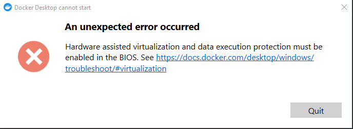

# kepler-docker
Why Docker - Simple and noob friendly setup for running everything needed for Kepler. 

Whats included? 

* Kepler
* Web-server for serving cast files, catalogue images and badges.
* Maria DB for the database
* PHPMyAdmin for managing the database

**Steps for spinning everything up**
- Install docker.
- Launch a terminal and navigate to this folder.
- Run `docker-compose up -d` in the terminal.
- Open the windows-client folder and click `Start hotel` this will launch a Macromedia projector that you can use to play locally. 

**Steps for spinning everything down** 
- Run `docker-compose down`  in the terminal.

NB: 
Make sure you have Docker installed. Follow the headlines below. 
Make sure Docker Desktop is running if you're on Windows. If you're not on Windows follow the appropriate install guide for installing Docker on your platform. 

## Installing docker

Follow https://docs.docker.com/desktop/windows/install/

Then install https://docs.microsoft.com/en-us/windows/wsl/install-manual#step-4---download-the-linux-kernel-update-package

Direct DL: https://wslstorestorage.blob.core.windows.net/wslblob/wsl_update_x64.msi

## Debugging docker

If you run into the follow problem:

See https://docs.docker.com/desktop/windows/troubleshoot/#virtualization

